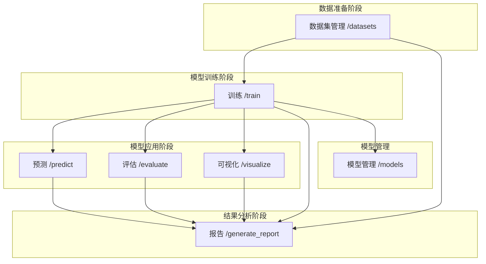

# 机器学习分类算法 REST API

这个项目实现了一个基于Flask的REST API，提供了三种常用的机器学习分类算法：逻辑回归、支持向量机(SVM)和决策树。支持模型训练、预测、评估、可视化和模型管理功能。

## 功能特点

- 支持多种分类算法（逻辑回归、SVM、决策树）
- 内置经典数据集（鸢尾花、乳腺癌）
- 支持自定义数据集的上传和管理
- 自动数据预处理和标准化
- 模型评估和性能指标分析
- 数据和模型可视化
- 模型持久化存储
- 完整的模型生命周期管理
- Swagger API文档

## 项目结构

```
.
├── README.md              # 项目文档
├── requirements.txt       # 依赖包列表
├── app.py                # 主应用程序
├── saved_models/         # 模型存储目录
│   ├── <model_id>        # 模型文件
│   └── <model_id>.meta   # 模型元数据
└── saved_datasets/       # 数据集存储目录
    ├── built_in_iris     # 内置数据集
    ├── built_in_iris.meta
    ├── built_in_breast_cancer
    ├── built_in_breast_cancer.meta
    ├── <dataset_id>      # 用户上传的数据集
    └── <dataset_id>.meta # 数据集元数据
```

## 安装

1. 克隆项目到本地
2. 创建并激活虚拟环境（推荐）：
```bash
python -m venv venv
source venv/bin/activate  # Linux/Mac
venv\\Scripts\\activate   # Windows
```

3. 安装依赖：
```bash
pip install -r requirements.txt
```

## 启动服务

```bash
python app.py
```

服务将在 http://localhost:5000 启动。访问此地址可以查看交互式Swagger API文档。

## API 依赖关系



## API 接口

### 1. 数据集管理

#### 获取数据集列表
**端点**: `/datasets`
**方法**: GET
**响应**:
```json
{
    "datasets": [
        {
            "dataset_id": "数据集ID",
            "name": "数据集名称",
            "description": "数据集描述",
            "shape": {
                "samples": 150,
                "features": 4
            },
            "type": "built_in|user_uploaded|custom",
            "creation_time": "创建时间"
        }
    ]
}
```

#### 上传新数据集
**端点**: `/datasets`
**方法**: POST
**请求体**:
```json
{
    "name": "数据集名称",
    "description": "数据集描述",
    "X": [[特征1, 特征2, ...], ...],
    "y": [标签1, 标签2, ...],
    "feature_names": ["特征名1", "特征名2", ...],
    "target_names": ["类别名1", "类别名2", ...]
}
```
**响应**:
```json
{
    "message": "数据集上传成功",
    "dataset_id": "数据集ID"
}
```

#### 获取数据集详情
**端点**: `/datasets/<dataset_id>`
**方法**: GET
**响应**:
```json
{
    "X": [[特征1, 特征2, ...], ...],
    "y": [标签1, 标签2, ...],
    "meta_data": {
        "name": "数据集名称",
        "description": "数据集描述",
        "feature_names": ["特征名1", "特征名2", ...],
        "target_names": ["类别名1", "类别名2", ...],
        "shape": {
            "samples": 150,
            "features": 4
        },
        "type": "built_in|user_uploaded|custom",
        "creation_time": "创建时间"
    }
}
```

#### 删除数据集
**端点**: `/datasets/<dataset_id>`
**方法**: DELETE
**响应**:
```json
{
    "message": "数据集删除成功"
}
```

### 2. 训练模型

**端点**: `/train`
**方法**: POST
**请求体**:
方式1 - 使用已存储的数据集：
```json
{
    "dataset_id": "数据集ID",
    "model_type": "logistic|svm|decision_tree",
    "params": {
        // 模型参数（可选）
    }
}
```

方式2 - 直接提供训练数据：
```json
{
    "X": [[特征1, 特征2, ...], ...],
    "y": [标签1, 标签2, ...],
    "model_type": "logistic|svm|decision_tree",
    "params": {
        // 模型参数（可选）
    }
}
```

**响应**:
```json
{
    "message": "模型训练成功",
    "model_id": "模型ID",
    "dataset_info": {
        "name": "数据集名称",
        "description": "数据集描述",
        "shape": {
            "samples": 150,
            "features": 4
        },
        "type": "built_in|user_uploaded|custom",
        "creation_time": "创建时间"
    }
}
```

### 3. 预测

**端点**: `/predict`
**方法**: POST
**请求体**:
```json
{
    "X": [[特征1, 特征2, ...], ...],
    "model_id": "模型ID"
}
```

**响应**:
```json
{
    "predictions": [预测1, 预测2, ...]
}
```

### 4. 模型评估

**端点**: `/evaluate`
**方法**: POST
**请求体**:
```json
{
    "X": [[特征1, 特征2, ...], ...],
    "y": [标签1, 标签2, ...],
    "model_id": "模型ID",
    "metrics": ["accuracy", "precision", "recall", "f1", "confusion_matrix"]
}
```

**响应**:
```json
{
    "accuracy": 0.95,
    "precision": 0.94,
    "recall": 0.93,
    "f1": 0.93,
    "confusion_matrix": [[...], [...]]
}
```

### 5. 可视化

**端点**: `/visualize`
**方法**: POST
**请求体**:
```json
{
    "X": [[特征1, 特征2, ...], ...],
    "y": [标签1, 标签2, ...],
    "model_id": "模型ID",
    "plot_type": "scatter|decision_boundary"
}
```

**响应**:
```json
{
    "image": "base64编码的图像"
}
```

### 6. 生成报告

**端点**: `/generate_report`
**方法**: POST
**请求体**:
```json
{
    "model_id": "模型ID",
    "dataset_info": {
        "name": "数据集名称",
        "description": "数据集描述",
        "feature_names": ["特征1", "特征2", ...],
        "target_names": ["类别1", "类别2", ...],
        "shape": [100, 4]
    },
    "training_info": {
        "model_type": "模型类型",
        "parameters": {},
        "training_time": "2023-XX-XX...",
        "convergence_info": "模型收敛信息"
    },
    "prediction_results": {
        "sample_predictions": [0, 1, 2, ...],
        "prediction_distribution": {"0": 30, "1": 40, "2": 30}
    },
    "evaluation_results": {
        "accuracy": 0.95,
        "precision": 0.94,
        "recall": 0.93,
        "f1": 0.93,
        "confusion_matrix": [[...], [...]]
    },
    "visualization_results": {
        "plots": ["base64编码的图像1", "base64编码的图像2"]
    }
}
```

**响应**:
```json
{
    "report_time": "2023-XX-XX...",
    "report_sections": {
        "dataset_analysis": {
            "summary": "数据集概述",
            "feature_importance": ["特征重要性分析"],
            "data_distribution": "数据分布说明"
        },
        "model_analysis": {
            "model_type": "模型类型",
            "parameters": "模型参数说明",
            "structure_summary": "模型结构概述"
        },
        "performance_analysis": {
            "metrics_summary": "性能指标总结",
            "prediction_analysis": "预测结果分析",
            "visualization_summary": "可视化结果解释"
        },
        "recommendations": {
            "model_improvements": ["改进建议1", "改进建议2"],
            "feature_suggestions": ["特征工程建议"],
            "parameter_tuning": ["参数调优建议"]
        }
    },
    "conclusion": "综合分析结论"
}
```

### 7. 模型管理

#### 获取模型列表
**端点**: `/models`
**方法**: GET
**响应**:
```json
{
    "models": [
        {
            "model_id": "模型ID",
            "model_type": "模型类型",
            "creation_time": "创建时间",
            "dataset_info": {
                "name": "数据集名称",
                "description": "数据集描述"
            }
        }
    ]
}
```

#### 获取模型详情
**端点**: `/models/<model_id>`
**方法**: GET
**响应**:
```json
{
    "model_id": "模型ID",
    "model_type": "模型类型",
    "creation_time": "创建时间",
    "params": {
        // 模型参数
    },
    "dataset_info": {
        "name": "数据集名称",
        "description": "数据集描述"
    }
}
```

#### 删除模型
**端点**: `/models/<model_id>`
**方法**: DELETE
**响应**:
```json
{
    "message": "模型删除成功"
}
```

## 使用示例

```python
import requests
import numpy as np
import pandas as pd
import json

# 1. 数据集管理
# 查看可用数据集
datasets = requests.get('http://localhost:5000/datasets').json()

# 获取内置数据集
iris_data = requests.get('http://localhost:5000/datasets/built_in_iris').json()

# 上传新数据集
new_dataset = {
    'name': 'my_dataset',
    'description': '自定义数据集',
    'X': [[1, 2], [3, 4], [5, 6]],
    'y': [0, 1, 0],
    'feature_names': ['feature1', 'feature2'],
    'target_names': ['class0', 'class1']
}
response = requests.post('http://localhost:5000/datasets', json=new_dataset)
dataset_id = response.json()['dataset_id']

data = requests.get(f'http://localhost:5000/datasets/{dataset_id}').json()
print(data)
X = data['X']
y = data['y']
meta_data = data['meta_data']

# 2. 使用数据集训练模型
response = requests.post('http://localhost:5000/train', json={
    'dataset_id': dataset_id,  # 使用已上传的数据集
    'model_type': 'logistic',
    'params': {'max_iter': 1000}
})
model_id = response.json()['model_id']

# 3. 预测
predictions = requests.post('http://localhost:5000/predict', json={
    'X': X,
    'model_id': model_id
}).json()

# 4. 评估模型
evaluation = requests.post('http://localhost:5000/evaluate', json={
    'X': X,
    'y': y,
    'model_id': model_id,
    'metrics': ['accuracy', 'precision', 'recall', 'f1', 'confusion_matrix']
}).json()

# 5. 可视化
visualization = requests.post('http://localhost:5000/visualize', json={
    'X': X,
    'y': y,
    'model_id': model_id,
    'plot_type': 'scatter'
}).json()

# 6. 生成综合报告
report = requests.post('http://localhost:5000/generate_report', json={
    'model_id': model_id,
    'dataset_info': {
        'name': 'iris',
        'description': meta_data['description'],
        'feature_names': meta_data['feature_names'],
        'target_names': meta_data['target_names'],
        'shape': list(meta_data['shape'].values())
    },
    'training_info': {
        'model_type': 'logistic',
        'parameters': {},
        'training_time': '2023-XX-XX...',
        'convergence_info': '模型收敛信息'
    },
    'prediction_results': {
        'sample_predictions': predictions['predictions'][:5],
        'prediction_distribution': {'0': 30, '1': 40, '2': 30}
    },
    'evaluation_results': evaluation,
    'visualization_results': {
        'plots': [visualization['image']]
    }
}).json()
print(json.dumps(report, indent=4))

# 清理（可选）
# 删除数据集
requests.delete(f'http://localhost:5000/datasets/{dataset_id}')
# 删除模型
requests.delete(f'http://localhost:5000/models/{model_id}')
```

## 注意事项

1. 数据集管理：
   - 内置数据集（iris和breast_cancer）不能被删除
   - 用户上传的数据集会被持久化存储
   - 支持通过dataset_id在训练时重用数据集
   - 训练时可以使用已存储的数据集或直接提供数据

2. 模型持久化：
   - 所有训练的模型都会自动保存到 `saved_models` 目录
   - 服务重启时会自动加载已保存的模型和数据集
   - 可以通过API管理模型和数据集的生命周期

3. 可视化限制：
   - 决策边界可视化仅支持2D特征
   - 建议使用较小的数据集进行可视化

4. 安全性：
   - 本API服务主要用于开发和测试
   - 生产环境使用时建议添加适当的认证和授权机制

## 部署指南

### 使用Docker部署

1. **安装Docker**
   ```bash
   # Ubuntu/Debian
   sudo apt-get update
   sudo apt-get install docker.io
   sudo systemctl start docker
   sudo systemctl enable docker
   
   # CentOS
   sudo yum install docker
   sudo systemctl start docker
   sudo systemctl enable docker
   ```

2. **构建Docker镜像**
   ```bash
   # 在项目根目录下执行
   sudo docker build -t ml-api:latest .
   ```

3. **运行容器**
   ```bash
   # 基本运行方式
   sudo docker run -d -p 5010:5000 --name ml-api ml-api:latest

   # 如果需要持久化存储模型和数据集，使用卷挂载
   sudo docker run -d \
       -p 5010:5000 \
       -v $(pwd)/saved_models:/app/saved_models \
       -v $(pwd)/saved_datasets:/app/saved_datasets \
       -v $(pwd)/logs:/app/logs \
       --name ml-api \
       ml-api:latest
   ```

4. **查看容器状态**
   ```bash
   # 查看运行状态
   sudo docker ps
   
   # 查看日志
   sudo docker logs ml-api
   ```

5. **管理容器**
   ```bash
   # 停止容器
   sudo docker stop ml-api
   
   # 启动容器
   sudo docker start ml-api
   
   # 重启容器
   sudo docker restart ml-api
   
   # 删除容器
   sudo docker rm ml-api
   ```

### 使用Docker Compose部署（推荐）

1. **安装Docker Compose**
   ```bash
   # Ubuntu/Debian
   sudo apt-get update
   sudo apt-get install docker-compose
   
   # 或者使用pip安装
   sudo pip install docker-compose
   ```

2. **创建必要的目录和设置权限**
   ```bash
   # 创建目录
   mkdir -p saved_models saved_datasets logs
   
   # 设置权限
   sudo chown -R $USER:$USER saved_models saved_datasets logs
   chmod -R 755 saved_models saved_datasets logs
   ```

3. **启动服务**
   ```bash
   sudo docker-compose up -d
   ```

4. **管理服务**
   ```bash
   # 查看日志
   sudo docker-compose logs
   
   # 停止服务
   sudo docker-compose down
   
   # 重新构建并启动
   sudo docker-compose up -d --build
   ```

### 生产环境配置说明

1. **端口配置**
   - API服务运行在容器内的5000端口
   - 映射到宿主机的5010端口
   - 访问地址：http://<server-ip>:5010

2. **资源限制**
   - CPU: 最大2核，最小0.5核
   - 内存: 最大2GB，最小512MB
   - 可在docker-compose.yml中调整

3. **性能优化**
   - 使用gunicorn作为WSGI服务器
   - 工作进程数：4（可通过WORKERS环境变量调整）
   - 请求超时：120秒
   - 最大请求数：1000（达到后工作进程会重启）

4. **日志配置**
   - 访问日志：logs/access.log
   - 错误日志：logs/error.log
   - Docker日志限制：最大10MB，保留3个文件

### 常见问题排查

1. **容器无法启动**
   - 检查端口是否被占用：`sudo netstat -tulpn | grep 5000`
   - 检查日志：`sudo docker logs ml-api`
   - 检查磁盘空间：`df -h`

2. **API响应慢**
   - 检查容器资源使用情况：`sudo docker stats ml-api`
   - 检查网络连接：`sudo docker exec ml-api netstat -tulpn`
   - 考虑增加工作进程数或调整资源限制

3. **数据持久化问题**
   - 检查卷挂载：`sudo docker inspect ml-api`
   - 确保目录权限正确：`sudo chown -R 1000:1000 saved_models saved_datasets`
   - 检查磁盘空间和inode使用情况
``` 