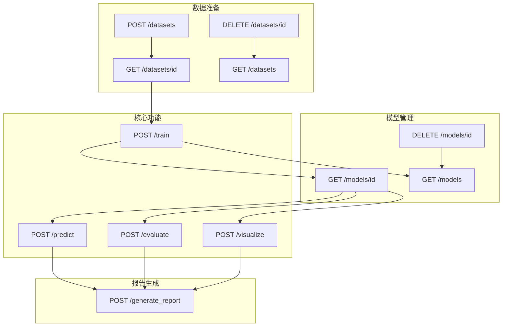
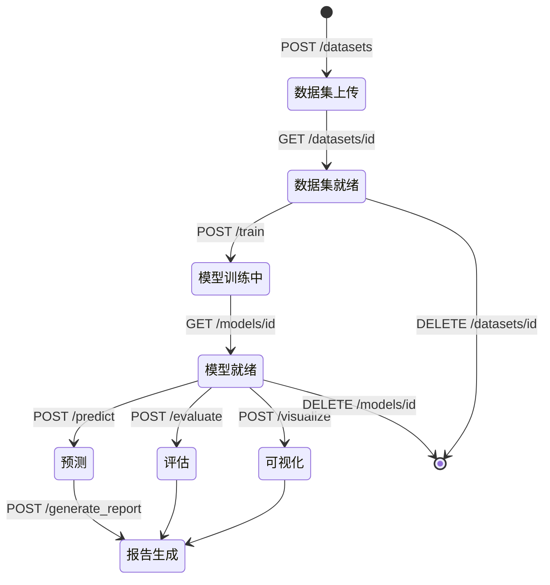

# 机器学习分类算法 API 文档

## API 服务架构

本服务实现了一个基于Flask的REST API，提供机器学习分类算法的训练、预测和评估功能。

## 实际API及其依赖关系

### 1. 数据集管理API

#### GET /datasets
- **功能**：获取所有可用数据集列表
- **条件参数**：无
- **影响参数**：无

#### POST /datasets
- **功能**：上传新数据集
- **条件参数**：无
- **影响参数**：
  - 创建新的数据集记录
  - 生成dataset_id
  - 保存数据集到文件系统

#### GET /datasets/{dataset_id}
- **功能**：获取指定数据集详情
- **条件参数**：
  - dataset_id必须存在
- **影响参数**：无

#### DELETE /datasets/{dataset_id}
- **功能**：删除指定数据集
- **条件参数**：
  - dataset_id必须存在
  - 不能是内置数据集
- **影响参数**：
  - 删除文件系统中的数据集文件
  - 从内存中移除数据集

### 2. 模型管理API

#### GET /models
- **功能**：获取所有已保存的模型列表
- **条件参数**：无
- **影响参数**：无

#### GET /models/{model_id}
- **功能参数**获取指定模型详情
- **条件参数**：
  - model_id必须存在
- **影响参数**：无

#### DELETE /models/{model_id}
- **功能**：删除指定模型
- **条件参数**：
  - model_id必须存在
- **影响参数**：
  - 删除文件系统中的模型文件
  - 从内存中移除模型

### 3. 训练API

#### POST /train
- **功能**：训练新模型
- **条件参数**：
  - 如果使用dataset_id，数据集必须存在
  - 如果直接提供数据，X和y必须格式正确
  - model_type须是支持的类型（logistic/svm/decision_tree）
- **影响参数**：
  - 创建新的模型实例
  - 生成model_id
  - 保存模型到文件系统
  - 更新models列表

### 4. 预测API

#### POST /predict
- **功能**：使用模型进行预测
- **条件参数**：
  - model_id必须存在
  - 输入数据格式必须正确
  - 模型必须已完成训练
- **影响参数**：无

### 5. 评估API

#### POST /evaluate
- **功能**：评估模型性能
- **条件参数**：
  - model_id必须存在
  - 测试数据格式必须正确
  - metrics必须是支持的指标（accuracy/precision/recall/f1/confusion_matrix）
- **影响参数**：无

### 6. 可视化API

#### POST /visualize
- **功能**：生成模型可视化
- **条件参数**：
  - model_id必须存在
  - plot_type必须是支持的类型（scatter/decision_boundary）
  - 对于决策边界图，特征必须是2D
- **影响参数**：
  - 生成临时图像文件
  - 返回base64编码的图像

### 7. 报告生成API

#### POST /generate_report
- **功能**：生成综合分析报告
- **条件参数**：
  - model_id必须存在
  - 必须提供完整的：
    - 数据集信息
    - 训练信息
    - 预测结果
    - 评估结果
    - 可视化结果
- **影响参数**：无

## API依赖关系图

## 资源状态流转图

## API调用注意事项

1. **数据集管理**
   - 内置数据集（iris和breast_cancer）不能被删除
   - 数据集一旦创建，ID不可更改
   - 删除数据集前需确保没有依赖的模型

2. **模型管理**
   - 模型训练是异步操作，需要通过GET /models/{model_id}查看状态
   - 删除模型前需确保没有正在进行的预测任务
   - 模型参数在训练后不可修改

3. **预测和评估**
   - 预测数据必须与训练数据具有相同的特征量
   - 评估指标必须是系统支持的类型
   - 可视化的决策边界仅支持2D特征

4. **资源管理**
   - 所有文件操作都有持久化存储
   - 系统启动时会自动加载已保存的模型和数据集
   - 建议定期清理不使用的模型和数据集 